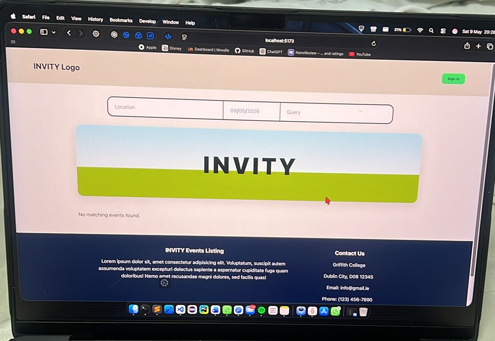
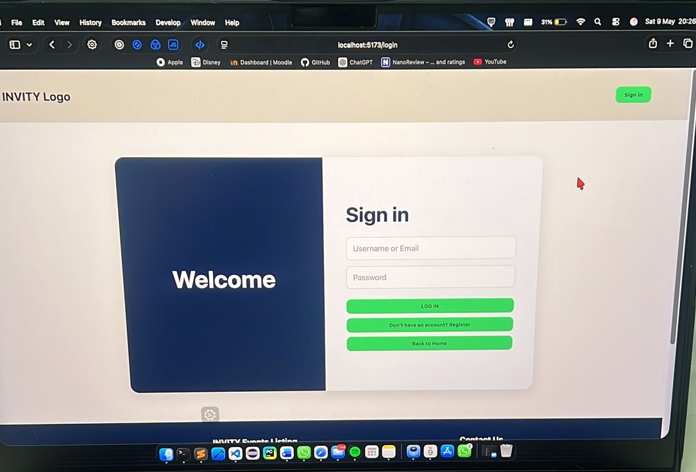
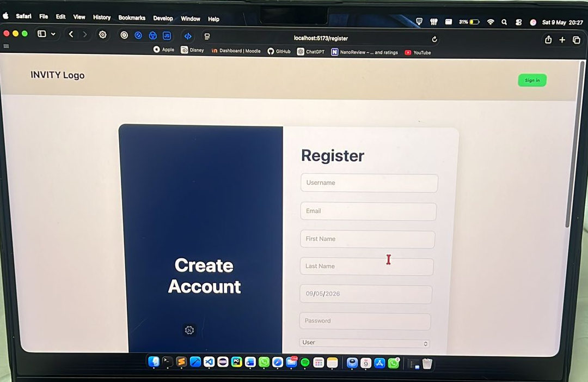
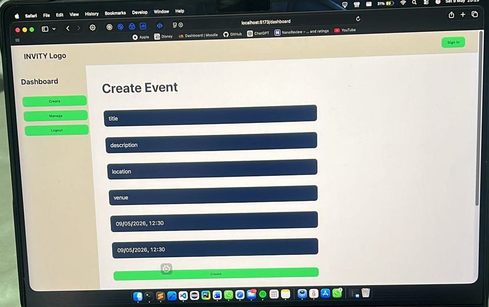

# INVITY - Event Management Platform

## Overview

INVITY is a full-stack event management platform developed using React, Node.js, Express, MongoDB, and Vite.

The application allows users to register, log in, create events, manage invitations, and interact with other users through a modern web interface.

---

## Technologies Used

### Frontend
- React
- Vite
- JavaScript
- CSS

### Backend
- Node.js
- Express.js
- MongoDB
- Mongoose

### Authentication
- bcrypt
- express-session
- connect-mongo

---

## Features

- User Registration
- User Login
- Session Authentication
- Protected Routes
- Event Creation
- Event Management
- Invitation System
- Comments System
- Responsive Design

---

## Screenshots

### Home Page



### Login Page



### Register Page



### Create Event Page



---

## Project Structure

```text
api/
frontend/
Screenshots/
README.md
```

---

## Team Contribution

### Guilherme Simão

- Authentication system implementation
- Session management
- Password hashing with bcrypt
- Protected routes middleware
- User registration and login
- CRUD operations
- API testing using Thunder Client
- Project documentation

---

## Installation

### Backend

```bash
cd api
npm install
npm start
```

### Frontend

```bash
cd frontend
npm install
npm run dev
```

---

## Environment Variables

Create:

### api/.env

```env
MONGO_URI=your_mongodb_connection_string
SESSION_SECRET=your_session_secret
PORT=9000
```

### frontend/.env

```env
VITE_REACT_APP_API_URL=http://localhost:9000
```